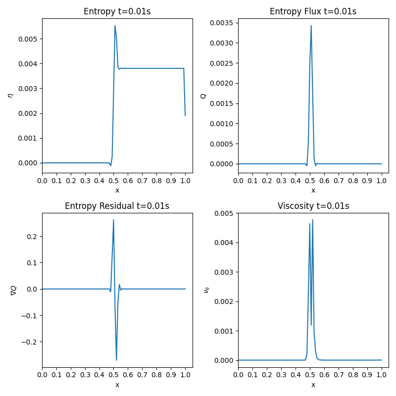

# Entropy Viscosity - 1D Sod Shock Tube Problem

Idea is to build on the existing FEM code developed to add entropy viscosity to the two step taylor galerkin/RK4 method.

## What about temporal term?
Temporal term is a bit tricky - In this first implementation we will neglect it and approximate the residual to the convection term of the entropy equation. This method detects the shocks well but is a bit over diffusive. It should be fine for first implementation. 

So, computing the entropy residual which will be the advection term of the entropy, it will be then used to calculate the entropy viscosity. This will be done in the first time-step. A zero viscosity is to be expected everywhere but the shock. 

## What have I done?

So firstly I define the entropy at the element as:

$$
\eta_{el} = \frac{\rho_{el}}{(\gamma-1)} log(\frac{p_{el}}{\rho_{el}^{\gamma}})
$$

The entropy flux at the element is taken as:

$$
Q_{el} = u_{el} \eta_{el}
$$

Where:

$$
u_{el} = m/\rho
$$

Thereafter sending these to the gaussian points we get:

$$
\eta_{gp} = N \cdot \eta_{el}
$$

$$
Q_{gp} = N \cdot \Q_{el}
$$

$$
\nabla Q_{gp} = N_x \cdot \ Q_{el}
$$

With this, we can calculate a viscosity given by:

$$
\nu_e = \frac{h^2 * \nabla Q}{|\max(\eta)-\min(\eta)|}    
$$

The entropy plots at t = 0.01 are as follows:

 

    

 

Showing indeed that we are capturing the jump as entropy changes, thus a viscosity is being added to dampen it.

Now adding the viscosity term calculated to our FEM formulation:

$$
\int (\frac{\partial U}{\partial t} + \frac{\partial F}{\partial x}) w + \nu_e \int \frac{\partial U}{\partial x} \frac{\partial w}{\partial x} 
$$

$$
\int \frac{\partial U}{\partial t} w - \int F w_x + \int \nu_e \frac{\partial U}{\partial x} \frac{\partial w}{\partial x} = 0
$$

$$
\sum \int N_A N_B \frac{\partial U}{\partial t} - \sum \int F_{gp} \frac{\partial N_A}{\partial x} + \sum \int \nu_e \frac{\partial N_B}{\partial x} \frac{\partial N_A}{\partial x} = 0
$$