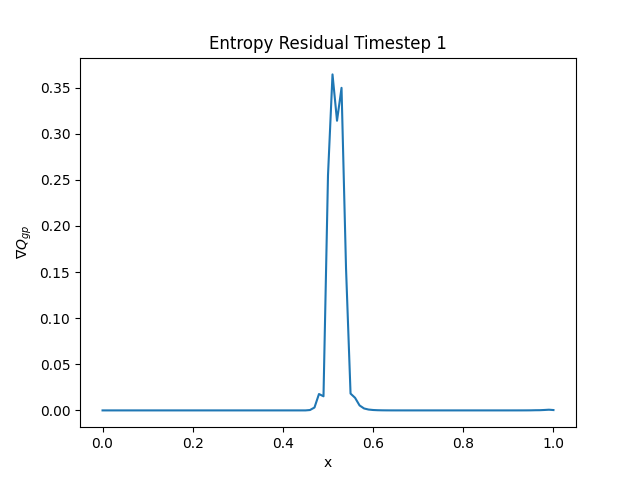
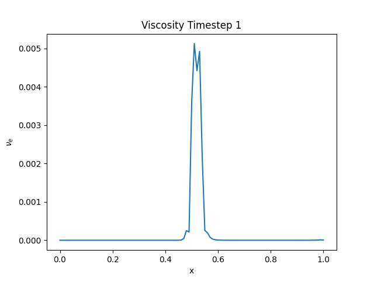

# Entropy Viscosity - 1D Sod Shock Tube Problem

Idea is to build on the existing FEM code developed to add entropy viscosity to the two step taylor galerkin/RK4 method.

## What about temporal term?
Temporal term is a bit tricky - In this first implementation we will neglect it and approximate the residual to the convection term of the entropy equation. This method detects the shocks well but is a bit over diffusive. It should be fine for first implementation. 

So, computing the entropy residual which will be the advection term of the entropy, it will be then used to calculate the entropy viscosity. This will be done in the first time-step. A zero viscosity is to be expected everywhere but the shock. 

## What have I done?

So firstly I define the entropy at the element as:

$$
\eta_{el} = \frac{\rho_{el}}{(\gamma-1)} log(\frac{p_{el}}{\rho_{el}^{\gamma}})
$$

The entropy flux at the element is taken as:

$$
Q_{el} = u_{el} \eta_{el}
$$

Where:

$$
u_{el} = m/\rho
$$

The entropy residual is then taken at the gaussian point using the derivative of the shape function as:

$$
\nabla Q_{gp} = N_x \cdot Q_{el}
$$

The plot show how at the first timestep (after timestep 0..) there is jump of the entropy residual corresponding to the initial shock of the shock tube problem.

 

    

 

The entropy itself is also calculated at the gaussian point using the shape function:

$$
\eta_{gp} = N \cdot \eta_{el}
$$

With this information we can calculate a viscosity given by:

$$
\nu_e = \frac{h^2 * \nabla Q}{|\max(\eta)-\min(\eta)|}    
$$

The plot of the viscosity calculated is:

 

    

 

Now adding the viscosity term calculated to our FEM formulation:

$$
\int (\frac{\partial U}{\partial t} + \frac{\partial F}{\partial x}) w + \nu_e \int \frac{\partial U}{\partial x} \frac{\partial w}{\partial x} 
$$

$$
\int \frac{\partial U}{\partial t} w \cancel{\left[w F \right]} - \int F w_x + \int \nu_e \frac{\partial u}{\partial x} \frac{\partial w}{\partial x} = 0
$$

$$
\sum \int N_A N_B \frac{\partial U}{\partial t} - \sum \int F_{gp} \frac{\partial N_A}{\partial x} + \sum \int \nu_e \frac{\partial N_B}{\partial x} \frac{\partial N_A}{\partial x} = 0
$$