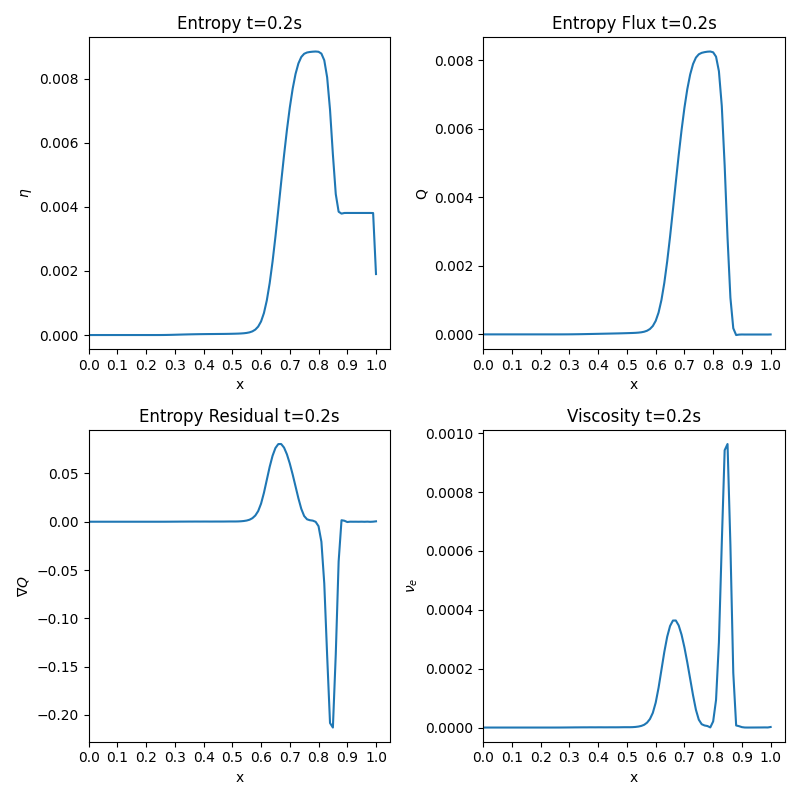

# Entropy Viscosity - 1D Sod Shock Tube Problem

Idea is to build on the existing FEM code developed to add entropy viscosity to the two step taylor galerkin/RK4 method.

## What about temporal term?
Temporal term is a bit tricky - In this first implementation we will neglect it and approximate the residual to the convection term of the entropy equation. This method detects the shocks well but is a bit over diffusive. It should be fine for first implementation. 

So, computing the entropy residual which will be the advection term of the entropy, it will be then used to calculate the entropy viscosity. This will be done in the first time-step. A zero viscosity is to be expected everywhere but the shock. 

## What have I done?

So firstly I define the entropy at the element as:

$$
\eta_{el} = \frac{\rho_{el}}{(\gamma-1)} log(\frac{p_{el}}{\rho_{el}^{\gamma}})
$$

The entropy flux at the element is taken as:

$$
Q_{el} = u_{el} \eta_{el}
$$

Where:

$$
u_{el} = m/\rho
$$

Thereafter sending these to the gaussian points we get:

$$
\eta_{gp} = N \cdot \eta_{el}
$$

$$
Q_{gp} = N \cdot Q_{el}
$$

$$
\nabla Q_{gp} = N_x \cdot Q_{el}
$$

With this, we can calculate a viscosity given by:

$$
\nu_e = \frac{h^2 * \nabla Q}{|\max(\eta)-\min(\eta)|}    
$$

The entropy plots at t = 0.2s are as follows:

 

    

 

Showing indeed that we are capturing the jump as entropy changes, thus a viscosity is being added to dampen it.

Now adding the viscosity term calculated to our FEM formulation:

$$
\int_{\Omega} w U_t dx - \int_{\Omega} w_x F(U) dx - \int_{\Omega} w_x F_{visc} (U) dx = 0
$$

Discretizing leads to:

$$
\sum \int N_A N_B U_t dx - \sum \int \frac{\partial N_B}{\partial x} F_{gp} dx - \sum \int \frac{\partial N_B}{\partial x} F^{visc}_{gp} dx = 0
$$

Since the viscosity is built after the MASS and FLUX matrices are built, another loop is created where the $$F^{visc}_{gp}$$ is calculated as follows: 

 

    

 

Where specifically each term again is taken from the current U and viscosity and sent to the Gaussian points:

$$
\nu_{el} = \frac {\mu_{el}}{\rho_{el}}
$$

$$
\mu_{gp} = N \cdot \mu_{el}
$$

$$
\nu_{gp} = N \cdot \nu_{el}
$$

$$
\nabla \rho_{gp} = N_x \cdot \rho_{el}
$$

$$
\nabla u_{gp} = N_x \cdot u_{el}
$$

$$
u_{gp} = N \cdot u_{el}
$$

$$
\kappa_{el} = \frac{\mu_{el}}{(\gamma - 1)}
$$

$$
\kappa_{gp} = N \cdot \kappa_{el}
$$

$$
T_{el} = \frac {p_{el}}{\rho_{el}}
$$

$$
T_{gp} = N \cdot T_{el} 
$$

Thereafter, now that the $$F_{visc}$$ is built the system of equations is solved with the RHS taken as:

$$
RHS = F + F_{visc_i}
$$

and the LHS as the mass matrix. 

## LPS - Local Projection Stabilization

This is a different stabilization method that has some over-undershoots and therefore can be combined quite nicely with the Entropy Viscosity method.

Formulating the LPS stabilized term:

$$
s_h^{LPS,e} = v_h^{LPS,e} \int_{K^e} \nabla w_h \cdot(\nabla U_h - g_h) dx
$$

Where:

$$
v^{LPS,e} = \frac{\omega h^e ||f'(u_h)||_{L^\infty(K^e)}}{2p}
$$

With $\omega = 1$ (default) $p = 1$ (degree of FEM polynomial).

Adding this to the FEM formulation leads to:

$$
\int_{\Omega} w U_t dx - \int_{\Omega} w_x F(U) dx - \int_{\Omega} w_x F_{visc} (U) dx + v_{LPS,e} \int_{\Omega} w_x \cdot(U_x - g) dx = 0
$$

## Evolution of numerical method used to solve the shock tube problem:

I first started off applying the standard galerkin for space and the RK4 time discretization scheme on the shock tube problem. All results shown are at a time = 0.2s. As you can see significant instabilities can be seen:

 

    

 

Thereafter a one-step Taylor Galerkin of order 2 was employed, which indeed didn't work great:

 

    

 

Following this a two-step Taylor Galerkin of order 2 was employed, significantly improving the stability, however not following the shocks at some points.

 

    

 

The next idea was to combine two-step Taylor Galerkin order 2 with a RK4 time stepping which improved shock capture yet still had some instabilities, as you can see at some points:

 

    

 

Following the next idea was to combine the RK4 TG2 two-step with Entropy viscosity! A greatly improved shock capture, however at points I believe it to be over-diffusive when the tunable constant c_e = 1:

 

    

 

Reducing this tunable constant c_e from =1 to =0.05 we get the following compromise:

 

    

 